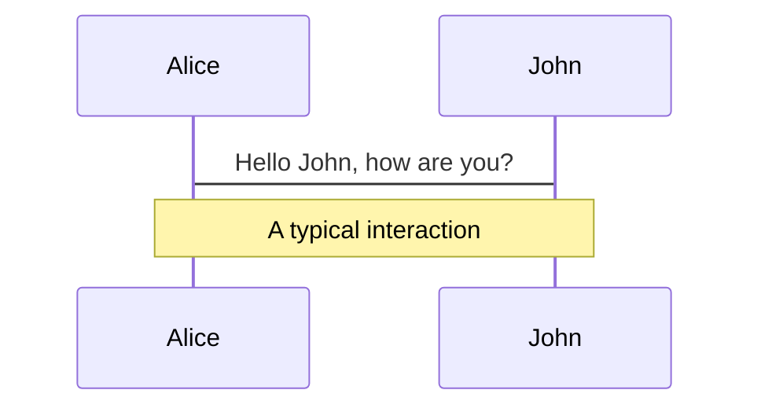
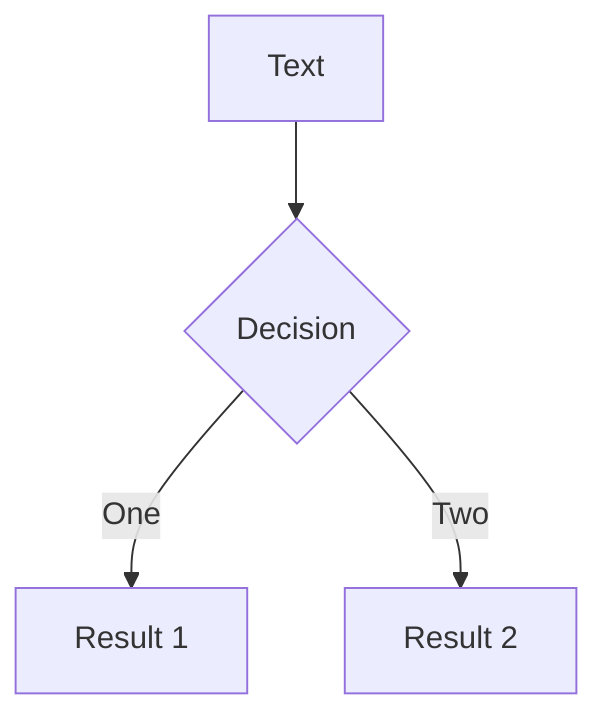
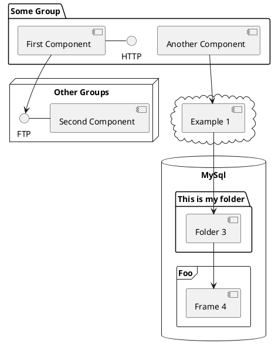

---
# try also 'default' to start simple
theme: seriph
# random image from a curated Unsplash collection by Anthony
# like them? see https://unsplash.com/collections/94734566/slidev
background: https://source.unsplash.com/collection/94734566/1920x1080
# apply any windi css classes to the current slide
class: "text-center"
# https://sli.dev/custom/highlighters.html
highlighter: prism
# show line numbers in code blocks
lineNumbers: false
# some information about the slides, markdown enabled
info: |
  ## Slidev Starter Template
  Presentation slides for developers.

  Learn more at [Sli.dev](https://sli.dev)
# persist drawings in exports and build
drawings:
  persist: false
# use UnoCSS
css: unocss
---

# Streaming SSR

The Lost Art Of Progressive HTML Rendering

---
layout: cover
---

# SSR问题I

静态资源加载时机被推迟

---


---
<!--
<div grid="~ cols-2 gap-4">

```js
const server = http.createServer(async (req, res) => {
  const data = await dataFetching();
  const html = template(data);
  res.writeHead(200, {
    "Content-Type": "text/html",
  });
  res.write(html)
  res.end();
});
```

<v-click>
```js
const server = http.createServer(async (req, res) => {
  res.writeHead(200, {
    "Content-Type": "text/html",
  });
  res.write(`
    <head>
      <link rel="stylesheet" href="style.css" />
      <script src="index.js"></script>
    </head>
  `)
  const data = await dataFetching();
  const html = template(data);
  res.write(html)
  res.end();
});
```
</v-click>

</div>

---


-->

---
layout: cover
---

# SSR问题II

HTML请求耗时由耗时最长的接口决定

---

<div grid="~ cols-2 gap-4">


<v-click>

```js
// loader for $group_id
export const loader = async ({ params }) => {
  const result = await getGroupInfo(params.group_id);
  return json(result)
}

// loader for $group_id/posts
export const loader = async ({ params }) => {
  const result = await getGroupPosts(params.group_id);
  return json(result)
}
```

</v-click>

</div>

<style>
  img {
    width: 200px;
    height: auto;
  }
</style>

---


# What is Streaming SSR?

<video controls v-click src="/media/ssr-streaming.mp4" />

<style>
video {
    height: 400px;
    width: auto;
  }
</style>

---

# How does it work?

<div grid="~ cols-2 gap-4">

```js {all|7-11}
const http = require("http");

const server = http.createServer(async (req, res) => {
  res.writeHead(200, {
    "Content-Type": "text/html",
  });
  res.write("<h1>Hello, World</h1>");
  await sleep(1000);
  res.write("<h2>Streaming SSR</h2>");
  await sleep(1000);
  res.write("<h3>Progressive HTML Rendering</h3>");
  res.end();
});

server.listen(3000)
```

<video controls v-click src="/media/streaming-demo.mov" />

</div>

<style>
  video {
    width: 300px;
    height: auto;
  }
</style>

---

# Background

<v-clicks>

- [The Lost Art Of Progressive HTML Rendering. Jeff Atwood, 2005](https://blog.codinghorror.com/the-lost-art-of-progressive-html-rendering/)
- [BigPipe: Pipelining web pages for high performance. Facebook, 2009](https://www.facebook.com/notes/10158791368532200/)
- [新浪微博的BigPipe后端实现技术分享. 微博, 2011](https://www.slideshare.net/slawdan/bigpipe1126adev)
- [MarkoJS. eBay, 2013](https://markojs.com/)
- [React 18. 2022](https://reactjs.org/blog/2022/03/29/react-v18.html#react-dom-server)

</v-clicks>


# Diagrams

You can create diagrams / graphs from textual descriptions, directly in your Markdown.

<div class="grid grid-cols-3 gap-10 pt-4 -mb-6">







</div>

[Learn More](https://sli.dev/guide/syntax.html#diagrams)

---

src: ./pages/multiple-entries.md
hide: false

---

---

layout: center
class: text-center

---

# Learn More

[Documentations](https://sli.dev) · [GitHub](https://github.com/slidevjs/slidev) · [Showcases](https://sli.dev/showcases.html)
